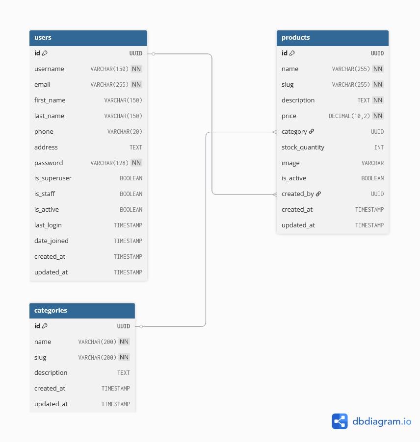

# Architecture / ERD

The project's Entity Relationship Diagram (ERD) is included in this folder.

Embedded diagram:

Notes:
- If you have the source diagram (e.g., `erd.drawio`, `erd.vsdx`), keep it here alongside the PNG for future edits.
- Recommended image size: 1200–2000px width for clarity when viewing in the repo or docs site.
- To reference the ERD from other docs, use `docs/architecture/erd.png`.

